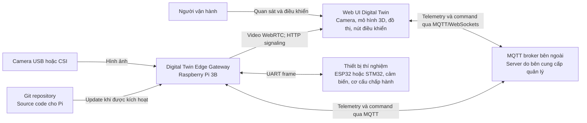

# C4 Level 1 — System Context

## Mục tiêu và phạm vi

**Trạng thái: đã chốt thiết kế.** Digital Twin Edge Gateway chạy trên Raspberry Pi 3B, kết nối thiết bị thí nghiệm vật lý với Web UI. Hệ thống cung cấp telemetry, chuyển tiếp command và cung cấp camera stream.

Phạm vi repo gồm application và configuration trên Pi. MQTT broker trên server bên ngoài, Web UI, MCU firmware và cơ cấu thí nghiệm là các hệ thống hoặc thiết bị ngoài phạm vi repo.

## Đối tượng tương tác

| Đối tượng | Tương tác |
| --- | --- |
| Người vận hành | Xem camera stream, telemetry, mô hình 3D và gửi command từ Web |
| Người bảo trì | Cấu hình Pi, kiểm tra service và kích hoạt update |
| Web UI | Nhận telemetry, gửi command qua MQTT/WebSockets; thiết lập WebRTC và nhận video từ Pi |
| MQTT broker bên ngoài | Phân phối telemetry và command giữa Pi với Web |
| MCU | Đọc cảm biến, điều khiển cơ cấu và trao đổi UART frame với Pi |
| Camera | Cung cấp hình ảnh cho camera service |
| Git repository | Lưu source code và version để Pi thực hiện update |

MCU giao tiếp với Pi qua UART; Pi và Web trao đổi telemetry và command qua broker bên ngoài. Pi chuyển tiếp command và telemetry. Camera dùng WebRTC theo yêu cầu tích hợp của Web; demo dùng HTTP chỉ để signaling, còn media không truyền dưới dạng HTTP MJPEG. Các yêu cầu real-time của điều khiển cơ cấu và xử lý lỗi tại thiết bị cần được xác định ở phía firmware.

## Giới hạn hiện tại

Chưa thiết kế cơ chế đồng bộ mô hình 3D phía Web, logic điều khiển chi tiết của firmware hoặc yêu cầu an toàn của từng cơ cấu. Flash firmware ESP32 từ Pi là tính năng dự kiến, chưa thuộc triển khai ban đầu.
