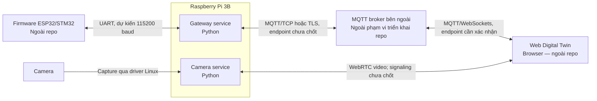

# C4 Level 2 — Containers

**Trạng thái: đã chốt thiết kế.** Pi chạy hai service độc lập: gateway và camera. MQTT broker chạy trên server bên ngoài; chưa xác nhận loại broker đang sử dụng. Task UART và MQTT bridge được triển khai trong cùng gateway service.

## Trách nhiệm

| Service | Trách nhiệm | Interface |
| --- | --- | --- |
| Gateway | Kết nối UART, kiểm tra frame, chuyển đổi telemetry và command | UART với MCU; MQTT với broker |
| Camera | Capture frame và cung cấp video track qua `aiortc` | Camera Linux; WebRTC với Web; HTTP signaling cho demo |

Gateway là process duy nhất của application mở UART port. Camera không phụ thuộc gateway để stream video. Broker bên ngoài phân phối message theo topic; repo chỉ quản lý phần kết nối client trên Pi.

## Data flow

1. **Telemetry:** cảm biến → MCU → UART → gateway validate và decode frame → MQTT publish → broker bên ngoài → Web qua WebSockets.
2. **Command:** Web → MQTT publish qua WebSockets → broker bên ngoài → gateway subscribe và validate command → encode UART frame → MCU → cơ cấu chấp hành.
3. **Video:** camera → camera service → WebRTC media track → Web UI. Trước khi media chạy, Web và Pi phải trao đổi SDP offer/answer và ICE candidate qua signaling.

Video không đi qua MQTT. MQTT publish thành công không xác nhận MCU đã thực thi command. Cần chốt protocol cho command acknowledgment riêng.

## Quyết định và điểm chưa chốt

- **Đã chốt:** service được quản lý bằng systemd; không yêu cầu Docker trong phase hiện tại.
- **Đã chốt:** UART frame có Header, Length, Payload và Checksum/CRC.
- **Đã chốt:** camera tích hợp với Web bằng WebRTC và implementation phía Pi dùng `aiortc`.
- **Đã triển khai:** `aiortc`, HTTP `POST /offer`, browser demo, peer limit, cleanup và simulated-camera WebRTC tests.
- **Đã chốt cho demo LAN:** browser tạo offer; HTTP `POST /offer` trả answer; không trickle ICE, STUN hoặc TURN; media chỉ truyền bằng WebRTC.
- **Cấu hình demo:** một camera 640×480 ở 30 FPS và một browser; pipeline bỏ frame cũ để hạn chế tăng latency.
- **Mở rộng dự kiến:** hai camera là hai video track trong một peer connection; 2 × 30 FPS là mục tiêu benchmark, không phải khả năng đã xác minh trên Pi 3B.
- **Chưa chốt cho production:** codec tối ưu, authentication, TLS, STUN/TURN, giới hạn peer và chính sách reconnect.
- **Chưa chốt:** endpoint MQTT và WebSockets, TLS, topic permissions, thư viện Python, schema MQTT, QoS, authentication, xử lý command và cơ chế reconnect.
- **Dự kiến:** flash firmware từ xa khi có nhu cầu và đủ điều kiện vận hành.
