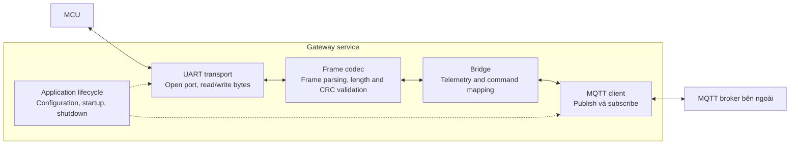
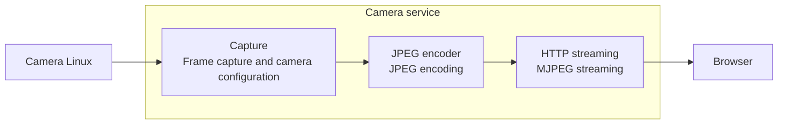

# C4 Level 3 — Components

Các component dưới đây mô tả trách nhiệm bên trong service. Khi triển khai, mỗi component có thể tương ứng với một hoặc nhiều module trong `src/`.

## Gateway service

UART transport quản lý serial connection và đọc/ghi byte. Frame codec parse byte stream, validate frame và encode frame gửi đi. Codec phải xử lý cả frame bị chia qua nhiều lần read và nhiều frame trong một lần read. Bridge chuyển đổi UART payload sang MQTT payload và validate command trước khi gửi xuống MCU. MQTT client quản lý connection, publish và subscribe theo topic đã cấu hình. Application lifecycle quản lý configuration, startup và shutdown, đồng thời giải phóng resource khi service dừng.

### UART protocol

**Đã chốt:** mỗi frame gồm `Header | Length | Payload | Checksum/CRC`. Frame không hợp lệ bị loại bỏ trước khi bridge xử lý payload.

**Chưa chốt:** giá trị header, kích thước length field, các byte được tính trong length, byte order, loại checksum/CRC và tham số của nó, vùng byte dùng để tính CRC, giới hạn payload, message type, đơn vị đo, timeout và cơ chế frame resynchronization khi gặp nhiễu. Các thông số này phải được thống nhất với firmware trước khi viết codec.

Chu kỳ telemetry 50 ms và baudrate 115200 là thông số dự kiến. Cần tính frame size và kiểm tra khả năng xử lý thực tế. Serial port phải cấu hình được.

### MQTT protocol

**Đã chốt:** phân biệt telemetry message từ thiết bị với command từ Web. Gateway publish telemetry và subscribe command; Web thực hiện chiều tương ứng.

**Chưa chốt:** tên topic, device ID, payload format, đơn vị dữ liệu, timestamp, schema version, QoS, retained message, command acknowledgment và connection status. Không tự động gửi lại command sau reconnect khi chưa chốt chính sách xử lý stale command.

## Camera service

Camera service sử dụng OpenCV với V4L2 backend, Flask cho HTTP endpoint và Waitress cho HTTP server. Một capture thread đọc camera và encode JPEG một lần cho mỗi frame. Các client dùng chung frame mới nhất; không tạo capture thread riêng cho từng client. `/video_feed` cung cấp MJPEG stream để Web hiển thị bằng thẻ `img`. `/health` trả HTTP 200 khi có frame còn hiệu lực, HTTP 503 khi camera unavailable.

Mặc định là 640×480, 15 FPS, JPEG quality 75 và tối đa 4 stream client. Configuration trong file YAML; resolution và FPS phải là số dương. Profile khuyến nghị ban đầu cho Pi 3B là 640×480 ở 15–20 FPS; đo tải trước khi tăng. Capture retry mỗi 2 giây khi open/read lỗi. Frame quá 5 giây không được sử dụng; stream đóng nếu không nhận được frame mới trong khoảng timeout, client cần reconnect. Khi hết client slot hoặc camera unavailable, `/video_feed` trả HTTP 503. Các thông số này có thể cấu hình. Backend, capture buffer size, OpenCV thread count, shutdown timeout, HTTP spare thread count, HTTP output buffer size cũng lấy từ configuration. Các giá trị vận hành nằm trong `services/camera/config.yaml`, tách khỏi Python code. `Config.from_yaml()` dùng YAML loader từ shared package, validate key, type và value, sau đó tạo configuration object. Tất cả field là bắt buộc; thiếu field hoặc có key không hợp lệ sẽ làm startup thất bại. Capture và HTTP server nhận configuration object, không đặt default riêng. File được chọn qua `--config` hoặc `CAMERA_CONFIG_FILE`; thay đổi configuration cần restart service. Tests dùng simulated frame đã xác minh JPEG output, client limit, cleanup, retry và stale frame. Chưa xác minh camera thật hoặc tải trên Pi 3B. Camera USB có thể xuất hiện tại `/dev/video0`; camera CSI cần kiểm tra pipeline và driver trên target OS, không mặc định mọi camera đều đọc được từ đường dẫn này.

## MQTT broker bên ngoài

Broker chạy trên server do bên cung cấp quản lý, nằm ngoài phạm vi triển khai của repo. Chưa xác nhận broker đang sử dụng là Mosquitto hay một broker khác. Gateway là MQTT client; Web dự kiến kết nối qua MQTT/WebSockets nếu server hỗ trợ.

Cần xác nhận hostname, port, TLS, credentials, topic được phép sử dụng và endpoint WebSockets trước khi tích hợp. Chi tiết kết nối nằm trong [deployment.md](deployment.md).

## Shared code và logging

`shared/` chứa package `digital-twin-common`, dùng chung cho Python service. Package cung cấp YAML mapping loader và logging initialization; không import code của camera hoặc gateway. Camera schema, capture và HTTP endpoint vẫn nằm trong `services/camera/`.

`config/logging.yaml` quản lý log level, format, date format và output handler. Mỗi service gọi `configure_logging()` một lần tại startup; module dùng `logging.getLogger(__name__)`. Profile hiện tại ghi stdout để systemd thu log qua journald. Có thể cấu hình level theo module bằng section `loggers` trong YAML.

Camera chọn logging file qua `--log-config` hoặc `LOG_CONFIG_FILE`. Logging configuration thiếu hoặc không hợp lệ sẽ làm startup thất bại. Restart service sau khi sửa YAML.
