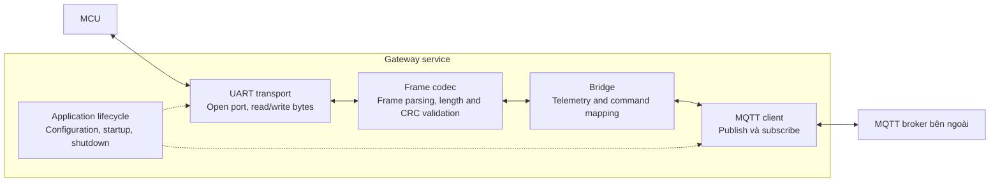
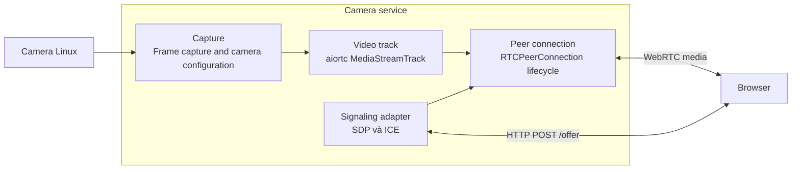

# C4 Level 3 — Components

Các component dưới đây mô tả trách nhiệm bên trong service. Khi triển khai, mỗi component có thể tương ứng với một hoặc nhiều module trong `src/`.

## Gateway service

UART transport quản lý serial connection và đọc/ghi byte. Frame codec parse byte stream, validate frame và encode frame gửi đi. Codec phải xử lý cả frame bị chia qua nhiều lần read và nhiều frame trong một lần read. Bridge chuyển đổi UART payload sang MQTT payload và validate command trước khi gửi xuống MCU. MQTT client quản lý connection, publish và subscribe theo topic đã cấu hình. Application lifecycle quản lý configuration, startup và shutdown, đồng thời giải phóng resource khi service dừng.

### UART protocol

**Đã chốt:** mỗi frame gồm `Header | Length | Payload | Checksum/CRC`. Frame không hợp lệ bị loại bỏ trước khi bridge xử lý payload.

**Chưa chốt:** giá trị header, kích thước length field, các byte được tính trong length, byte order, loại checksum/CRC và tham số của nó, vùng byte dùng để tính CRC, giới hạn payload, message type, đơn vị đo, timeout và cơ chế frame resynchronization khi gặp nhiễu. Các thông số này phải được thống nhất với firmware trước khi viết codec.

Chu kỳ telemetry 50 ms và baudrate 115200 là thông số dự kiến. Cần tính frame size và kiểm tra khả năng xử lý thực tế. Serial port phải cấu hình được.

### MQTT protocol

**Đã chốt:** phân biệt telemetry message từ thiết bị với command từ Web. Gateway publish telemetry và subscribe command; Web thực hiện chiều tương ứng.

**Chưa chốt:** tên topic, device ID, payload format, đơn vị dữ liệu, timestamp, schema version, QoS, retained message, command acknowledgment và connection status. Không tự động gửi lại command sau reconnect khi chưa chốt chính sách xử lý stale command.

## Camera service

**Đã triển khai:** WebRTC bằng `aiortc`, HTTP signaling và browser demo. **Chưa xác minh:** hiệu năng WebRTC trên Pi 3B.

### WebRTC implementation

Camera service dùng OpenCV/V4L2 để capture camera USB và `aiortc` để tạo một video track cho mỗi camera cùng `RTCPeerConnection` cho browser. WebRTC chịu trách nhiệm vận chuyển media real-time, media encryption, congestion control và báo cáo trạng thái kết nối. Demo dùng HTTP `POST /offer` để trao đổi SDP trước khi media chạy; frame video không đi qua HTTP.

Mỗi browser tạo một peer connection có lifecycle riêng. Service đóng peer khi connection disconnected/failed/closed, giới hạn peer bằng `max_peers` và đóng toàn bộ peer cùng camera khi service dừng. Mỗi camera chỉ có một capture thread; các peer đọc frame mới nhất từ nguồn dùng chung và không tích hàng đợi.

Demo LAN tự định nghĩa browser là offerer và dùng HTTP `POST /offer` để gửi SDP offer rồi nhận SDP answer trong một request/response; không dùng trickle ICE, STUN hoặc TURN. HTTP chỉ là control plane cho signaling, không mang video frame. `aiortc` là implementation WebRTC bằng Python dựa trên `asyncio`; nó không thay thế signaling và không tự cung cấp TURN. Authentication, TLS và topology production vẫn cần chốt khi tích hợp Web thật.

`GET /` trả browser demo, `GET /health` trả trạng thái từng camera và số peer, `POST /offer` nhận SDP offer rồi trả SDP answer. Profile demo đặt mục tiêu một camera 640×480 ở 30 FPS, một browser và latest-frame semantics: pipeline bỏ frame cũ nếu encode không kịp để tránh hàng đợi làm tăng latency. Configuration nhận danh sách `devices` để thêm `/dev/video1` và phát hai video track trong cùng peer connection. Phải benchmark CPU, RAM, nhiệt độ, bitrate và end-to-end latency; nếu hai camera không giữ được 30 FPS trên Pi 3B thì giảm FPS thay vì tích frame.

## MQTT broker bên ngoài

Broker chạy trên server do bên cung cấp quản lý, nằm ngoài phạm vi triển khai của repo. Chưa xác nhận broker đang sử dụng là Mosquitto hay một broker khác. Gateway là MQTT client; Web dự kiến kết nối qua MQTT/WebSockets nếu server hỗ trợ.

Cần xác nhận hostname, port, TLS, credentials, topic được phép sử dụng và endpoint WebSockets trước khi tích hợp. Chi tiết kết nối nằm trong [deployment.md](deployment.md).

## Shared code và logging

`shared/` chứa package `digital-twin-common`, dùng chung cho Python service. Package cung cấp YAML mapping loader và logging initialization; không import code của camera hoặc gateway. Camera schema, capture và HTTP endpoint vẫn nằm trong `services/camera/`.

`config/logging.yaml` quản lý log level, format, date format và output handler. Mỗi service gọi `configure_logging()` một lần tại startup; module dùng `logging.getLogger(__name__)`. Profile hiện tại ghi stdout để systemd thu log qua journald. Có thể cấu hình level theo module bằng section `loggers` trong YAML.

Camera chọn logging file qua `--log-config` hoặc `LOG_CONFIG_FILE`. Logging configuration thiếu hoặc không hợp lệ sẽ làm startup thất bại. Restart service sau khi sửa YAML.
