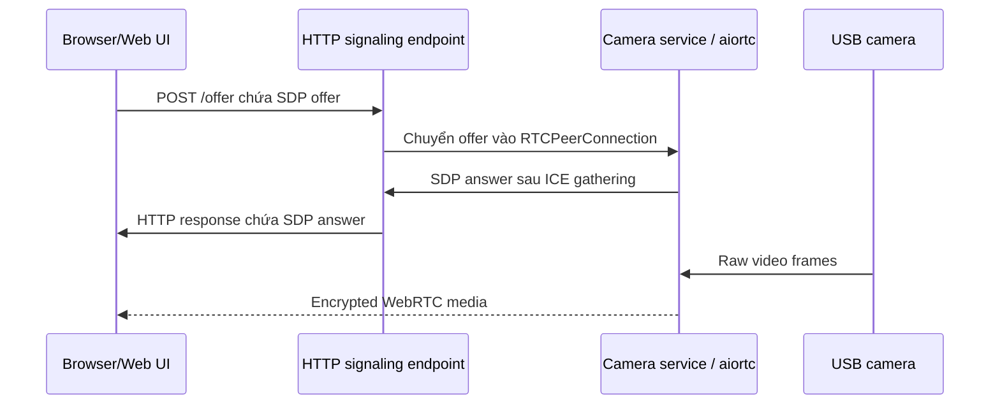

# Camera WebRTC integration

## Trạng thái quyết định

- **Đã chốt:** Web nhận camera bằng WebRTC; phía Pi dùng thư viện Python `aiortc`.
- **Đã triển khai:** HTTP offer/answer signaling, browser demo, `aiortc` peer connection, one-track-per-camera và simulated-camera end-to-end frame test.
- **Đã chốt cho demo LAN:** browser tạo offer; HTTP `POST /offer` chỉ trao đổi SDP; không dùng trickle ICE, STUN hoặc TURN; video chỉ truyền bằng WebRTC.
- **Profile đã đo trên Pi 3B:** một camera 640×480 ở 15 FPS, một browser, ưu tiên độ trễ thấp và bỏ frame cũ khi xử lý không kịp.
- **Mở rộng dự kiến:** hai camera thành hai video track trong cùng peer connection và phải benchmark riêng ở 15 FPS.
- **Chưa chốt cho production:** authentication, HTTPS, STUN/TURN, codec tối ưu, session limit và topology khác LAN.

`aiortc` là thư viện triển khai WebRTC/ORTC trên Python dựa trên `asyncio`. WebRTC là tập hợp API và protocol cho media real-time giữa các peer. Hai khái niệm này không đồng nghĩa: WebRTC là chuẩn giao tiếp, còn `aiortc` là công cụ được chọn để Pi tham gia kết nối đó.

## Luồng kết nối

Signaling chỉ giúp hai peer tìm nhau và thống nhất session. WebRTC specification không bắt buộc một signaling transport cụ thể. Demo chọn một HTTP request/response để giảm số thành phần: browser gửi SDP offer tới `POST /offer` và Pi trả SDP answer. HTTP không mang frame video; sau khi ICE chọn được đường truyền và bảo mật được thiết lập, video chỉ đi qua WebRTC media transport.

Trong cùng LAN, hai peer thường kết nối trực tiếp bằng địa chỉ nội bộ nên demo không cấu hình STUN/TURN. Khi khác mạng hoặc qua NAT/firewall, STUN hỗ trợ khám phá địa chỉ và TURN relay media khi không tạo được đường trực tiếp. `aiortc` không tự triển khai hạ tầng STUN/TURN.

## So sánh với MJPEG qua HTTP

| Tiêu chí | MJPEG qua HTTP trước đây | WebRTC bằng `aiortc` hiện tại |
| --- | --- | --- |
| Cách truyền | Nhiều ảnh JPEG hoàn chỉnh trong một HTTP response | Video track qua SRTP media transport được peer connection thiết lập |
| Tích hợp browser | Thẻ `img` trỏ tới `/video_feed` | JavaScript tạo `RTCPeerConnection` và gắn `MediaStream` vào thẻ `video` |
| Signaling | Không cần negotiation | Bắt buộc trao đổi SDP và ICE qua HTTP/WebSocket hoặc kênh khác |
| Độ trễ | Đơn giản nhưng dễ tăng trễ khi mạng hoặc buffer không phù hợp | Thiết kế cho real-time và có congestion control |
| Băng thông | Cao vì mỗi frame là một JPEG độc lập | Codec video tận dụng quan hệ giữa các frame, thường hiệu quả hơn |
| Mạng thay đổi | Không có cơ chế media adaptation chuẩn | Có feedback, congestion control và thống kê kết nối |
| Bảo mật media | Phụ thuộc HTTPS; bản hiện tại chỉ HTTP | Media WebRTC được mã hóa theo session |
| NAT/firewall | Muốn truy cập từ Internet phải tự bố trí đường HTTP/reverse proxy | ICE/STUN/TURN hỗ trợ tìm đường hoặc relay, nhưng cần hạ tầng và cấu hình |
| Độ phức tạp Pi | Ít state và dễ debug | Phải quản lý peer connection, codec, async lifecycle và cleanup |
| Tải Pi 3B | JPEG encode tốn CPU và băng thông | Video encode có thể tiết kiệm băng thông nhưng codec software vẫn có thể quá tải CPU |
| Nhiều người xem | Mỗi client nhận một bản MJPEG; băng thông tăng theo client | Mỗi peer có connection và encode/send cost; cần đo hoặc dùng media server khi scale |

HTTP và WebRTC không loại trừ nhau. Implementation dùng HTTP cho trang demo, `/health` và `/offer`; video không còn được vận chuyển dưới dạng MJPEG response và endpoint `/video_feed` đã bị loại bỏ.

## Cấu hình demo và định hướng hai camera

Browser demo dùng một `RTCPeerConnection`, gửi offer bằng `POST /offer` và gắn video track nhận được vào thẻ `video`. Bản đầu giới hạn một browser để kết quả benchmark phản ánh chi phí camera và codec thay vì tải từ nhiều peer.

Nguồn capture đặt mục tiêu 640×480 @ 15 FPS với buffer nhỏ. Pipeline luôn ưu tiên frame mới nhất; nếu encode hoặc network chậm thì bỏ frame cũ thay vì tích hàng đợi. FPS cao không tự bảo đảm độ trễ thấp, nên phải đo end-to-end latency cùng CPU, nhiệt độ và frame thực nhận.

Ở 640×480, `aiortc 1.15` mặc định chọn một thread cho libvpx. Camera service đặt `vp8_threads: 2` để thử cho một encoder dùng hai core trên Pi 3B. Đây là tuning theo implementation nội bộ của aiortc và phải benchmark: nhiều thread tạo thêm overhead, còn mỗi browser peer vẫn có encoder độc lập.

Thiết kế source nhận danh sách camera để sau này thêm `/dev/video1`. Hai camera dùng hai capture source và hai video track trong cùng peer connection. Kết quả một camera cho thấy mã hóa VP8 là giới hạn chính, vì vậy hai camera bắt đầu benchmark ở 2 × 640×480 @ 15 FPS và phải giảm tiếp nếu CPU, nguồn hoặc latency vượt giới hạn.

## Vì sao phía Web quy định protocol

Camera service và Web UI phải thống nhất cùng một interface. Nếu Web đã xây player quanh `RTCPeerConnection`, Web cần nhận SDP/ICE và WebRTC media track; endpoint MJPEG không thể cắm trực tiếp vào flow này. Phía Web thường chọn WebRTC khi sản phẩm cần độ trễ thấp, playback bằng browser API chuẩn, media encryption, congestion control, thống kê chất lượng hoặc khả năng kết nối qua nhiều loại mạng.

Trong demo này, repo tự định nghĩa cả browser và signaling contract nên có thể triển khai `POST /offer` trước. Khi tích hợp với Web thật, đội Web phải xác nhận contract này hoặc cung cấp contract thay thế; câu “dùng aiortc” chỉ chốt implementation phía Pi, chưa chốt signaling và hạ tầng production.

## Tiêu chí triển khai và nghiệm thu

1. Browser gửi offer bằng `POST /offer`, nhận answer và hoàn tất ICE trong cùng LAN.
2. Browser nhận đúng một video track và đóng peer sạch khi rời trang.
3. Service dùng chung một nguồn camera cho các peer, giới hạn peer đồng thời và cleanup connection lỗi.
4. `/health` phản ánh được camera readiness và trạng thái service; signaling lỗi trả thông tin đủ để Web xử lý.
5. Một camera đạt mục tiêu 640×480 @ 15 FPS; so sánh `vp8_threads: 1` và `2`, đồng thời đo CPU, RAM, nhiệt độ, FPS thực, bitrate và end-to-end latency.
6. Thử reconnect sau khi browser refresh, camera read lỗi, Wi-Fi gián đoạn và service restart.
7. Benchmark lại với hai camera/two tracks; ghi rõ FPS bền vững thay vì mặc định 2 × 30 FPS.
8. Khi chuyển khỏi LAN, thử topology triển khai thật và thêm TURN nếu direct connection không đáng tin cậy.

## Tài liệu tham khảo

- [aiortc documentation](https://aiortc.readthedocs.io/)
- [aiortc API reference](https://aiortc.readthedocs.io/en/latest/api.html)
- [W3C WebRTC Recommendation](https://www.w3.org/TR/webrtc/)
