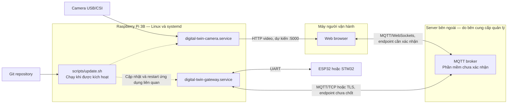

# Deployment — Raspberry Pi 3B

**Trạng thái:** camera service có implementation và systemd unit; chưa được triển khai hoặc benchmark trên Pi 3B. Gateway unit và update script vẫn là placeholder.

## Service và resource

| Service | Configuration trong repo | Resource |
| --- | --- | --- |
| Gateway | `deploy/systemd/digital-twin-gateway.service` | Serial và MQTT |
| Camera | `deploy/systemd/digital-twin-camera.service` | Camera và HTTP listener |

MQTT broker nằm ngoài Pi và không có cấu hình triển khai trong repo. Gateway và camera có unit riêng để quản lý khởi động, dừng và restart độc lập. Camera virtual environment cần cài cả `shared/` và `services/camera/`. Camera unit sử dụng user `digital-twin`, group bổ sung `video`, `Restart=on-failure` và timeout shutdown 10 giây. Gateway unit chưa có configuration thực thi.

Pi 3B có tài nguyên hạn chế; bắt đầu camera ở 640×480, mục tiêu 15–20 FPS và đo CPU, RAM, UART latency và video latency trước khi tăng tải. Chưa có benchmark trong repo.

## UART và camera

- USB-to-UART: đường dẫn dự kiến `/dev/ttyUSB0`; nên kiểm tra tên ổn định như `/dev/serial/by-id/` nếu thiết bị hỗ trợ.
- GPIO UART: TX GPIO14, RX GPIO15 qua `/dev/serial0`; cần cấu hình UART và kiểm tra serial console trên target OS.
- Baudrate ban đầu dự kiến 115200; phải trùng cấu hình firmware.
- Kết nối UART GPIO cần TX/RX nối chéo, chung GND và mức tín hiệu tương thích 3,3 V.
- Camera USB: kiểm tra thiết bị V4L2 thực tế. Camera CSI: xác nhận driver và cách capture tương thích.

Chỉ một process mở UART port tại một thời điểm. Nếu bổ sung flash firmware từ Pi, phải dừng gateway và giải phóng serial trước khi flash tool sử dụng port.

## Cấu hình triển khai

UART port, camera configuration, broker endpoint và HTTP port phải cấu hình được khi triển khai. Camera đọc YAML, xem [camera README](../services/camera/README.md) và `services/camera/config.yaml`. Python không lưu default cho các giá trị vận hành. Camera unit giả định repo tại `/opt/digital_twin`, virtual environment tại `services/camera/.venv`, và YAML configuration tại `/etc/digital-twin/camera.yaml`, được chọn qua `CAMERA_CONFIG_FILE` trong unit. Logging configuration tại `/etc/digital-twin/logging.yaml`, được chọn qua `LOG_CONFIG_FILE` trong unit. File mẫu nằm tại `config/logging.yaml`; stdout được systemd thu qua journald. Configuration phải tồn tại và hợp lệ trước khi service khởi động. Dùng `--config` để chọn file khi chạy thủ công; restart service sau khi sửa YAML. Gateway configuration chưa chốt. Giá trị riêng cho thiết bị, credentials, log, video và build artifact không lưu vào Git.

Pi cần kết nối được đến broker bên ngoài. Web cần endpoint MQTT/WebSockets do bên cung cấp xác nhận và đường truy cập riêng đến camera trên Pi. Broker chỉ chuyển tiếp dữ liệu MQTT, không tự cung cấp đường truy cập video từ Internet vào Pi.

Camera HTTP mặc định listen `0.0.0.0:5000`, chưa có authentication hoặc TLS; phạm vi triển khai ban đầu là mạng local. Địa chỉ Pi và phương án truy cập video phụ thuộc mạng triển khai. Nếu Web dùng HTTPS, cần bố trí kết nối video và WebSockets tương thích để tránh bị trình duyệt chặn mixed content.

### Thông tin broker cần xác nhận

Các hostname được cung cấp để xác định dịch vụ:

- `mqtt.mysignage.vn`
- `thachthanh.vov.link`
- `remote.mysignage.vn`
- `ybimqtt.mysignage.vn`

Chưa chọn hostname làm endpoint chính, chưa xác định vai trò của từng hostname và chưa xác nhận loại broker đang sử dụng. Danh sách này không phải cấu hình kết nối đã kiểm chứng hoặc thông tin tài khoản.

Trước khi tích hợp, cần xác nhận:

- Hostname và port MQTT dành cho gateway; có yêu cầu TLS hay không.
- Username/password hoặc authentication method khác.
- Topic và quyền publish/subscribe được cấp cho thiết bị và Web.
- URL WebSockets cho Web, gồm `ws://` hoặc `wss://`, port và path; khả năng hỗ trợ WebSockets hiện chưa xác nhận.
- QoS, retained message và connection limit phù hợp với dịch vụ.

Không mặc định server dùng port 1883, 8883 hoặc 9001. Credentials thực tế không lưu trong Git.

## Software update

Update script đặt tại `scripts/update.sh`, chưa cần service chạy liên tục. Thiết kế ban đầu là lấy phiên bản từ Git rồi restart ứng dụng liên quan qua systemd.

Trước khi triển khai cần chốt branch hoặc version, quyền cập nhật, xử lý working tree có thay đổi, dependency, health check sau restart và rollback khi update lỗi. Branch `main` và thao tác `git pull` là phương án ban đầu, chưa phải quy trình vận hành hoàn chỉnh.

Flash firmware ESP32 từ xa và lịch cập nhật bằng systemd timer là tính năng dự kiến, chưa triển khai.
